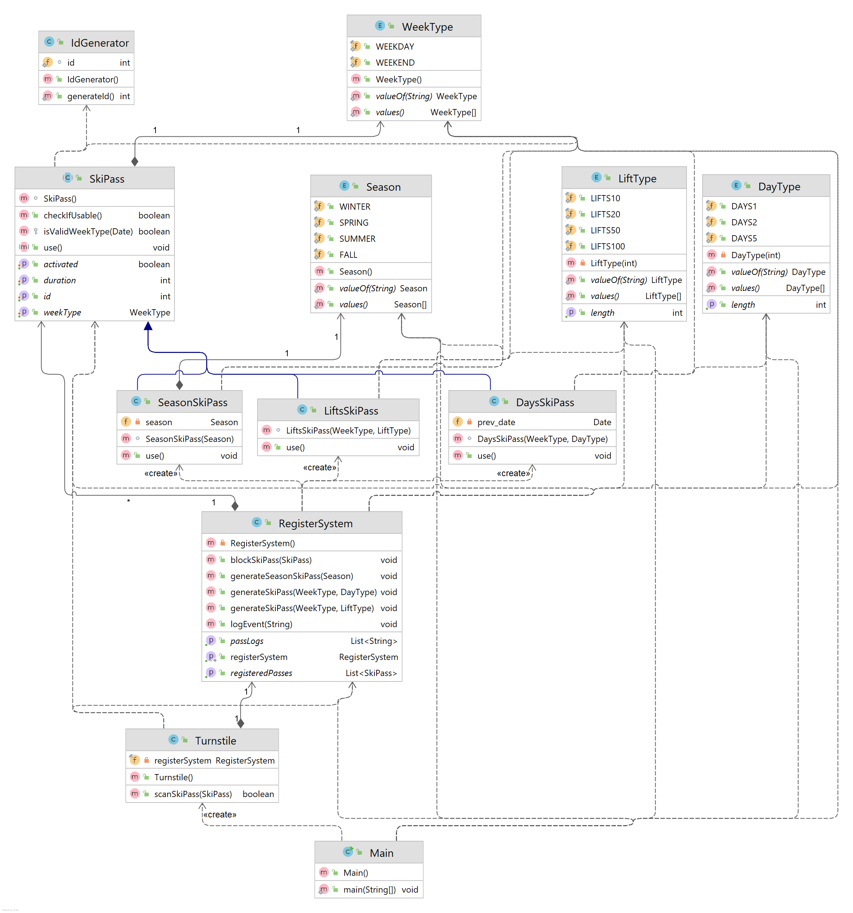

# SkiPassSimulation

This is my Midterm solution for the task.

## How I Solved it

- I have an abstract class SkiPass, which has some basic methods implemented.
- Then I implemented LiftsSkiPass, DaysSkiPass and SeasonSkiPass as instances of SkiPass.
- I also have enums DayType(If we choose days), LiftsType(If we choose lists) and WeekType for type of the week. 
- Also I have Season for SeasonSkiPass.
- The Turnstile uses the SkiPass and checks if it is still valid.
- The skipass blocking and generation is done in **RegisterSystem**. It also keeps track of all the registered SkiPasses and logs the SkiPass passes at the TurnStile.
  - The creation of a SkiPass can only be doe via RegisterSystem. This is implemented using package-private constructors.
- Also implemented the system which works on real days and seasons.
- In the Main file there is a small demonstration of how everything works.
- Each object has only 1 purpose(Single-Responsibility)
- Adding new cards is easy by either giving new values to enum or creating a new SkiPass class without editing everything else.(Open-Closed)
- The system works as with any SkiPass(Liskov).
- The cards don't depend on the not used functionality(Interface Segregarion)